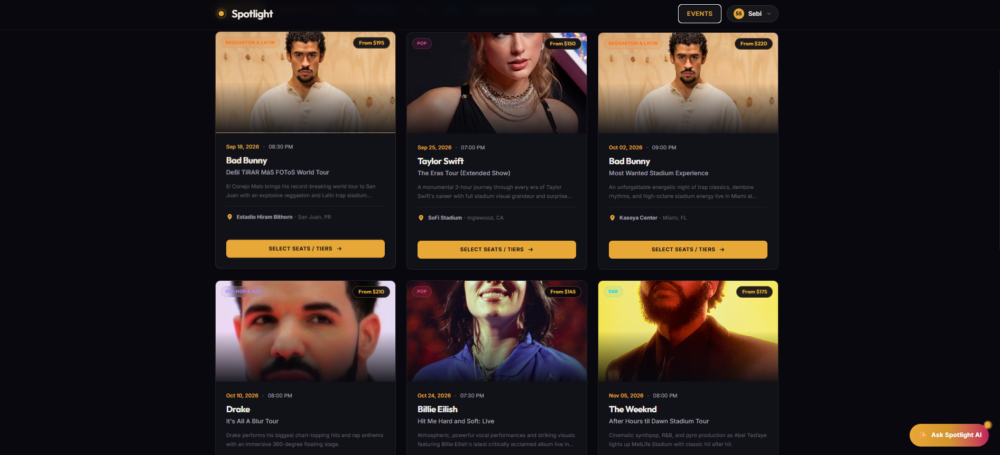
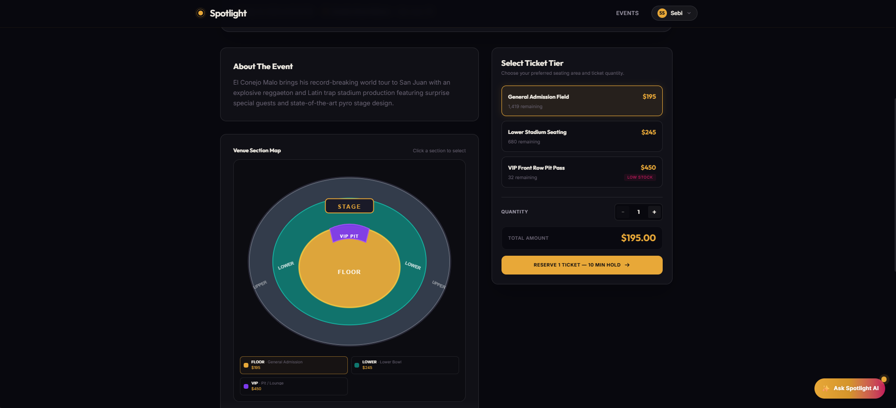
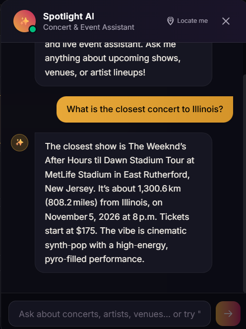
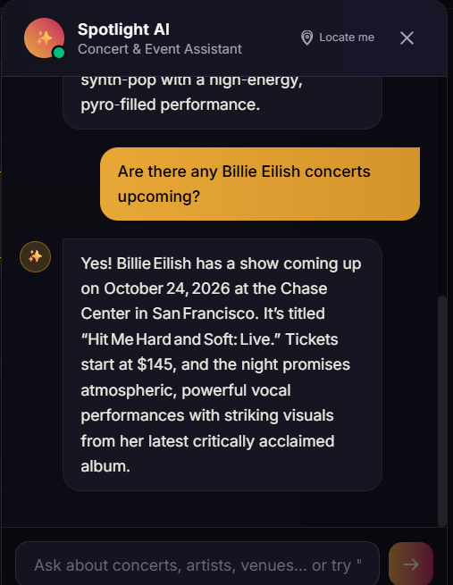

# Spotlight

> **Disclaimer:** This is an unofficial portfolio project built strictly for demonstration purposes. It is not affiliated with, endorsed by, or connected to any commercial ticketing vendor or live event platform.

Spotlight is a concert discovery and ticketing app built with a Ruby on Rails backend, a React frontend, and a Python assistant service. It includes an embedded AI chatbot that helps users find concerts by location, artist, or specific date ranges.

---

## Previews

<div align="center">

### Home Dashboard


_Browse upcoming concerts, featured artists, and venues._

<br/>

### Event Details & Seat Selector


_View seating maps, ticket options, and availability._

<br/>

### AI Assistant Chatbot

<table align="center">
  <tr>
    <td align="center">
      <br/>
      <sub><i>Chatbot location search response</i></sub>
    </td>
    <td align="center">
      <br/>
      <sub><i>Chatbot artist query response</i></sub>
    </td>
  </tr>
</table>

_Ask questions like "What is the closest concert to California?" or "Any shows next month?"._

</div>

---

## Features

- **Admin Management Console**:
  - **Full CRUD for Events & Venues**: Create, view, update, and delete concerts, dates, descriptions, statuses (`draft`, `published`, `cancelled`, `sold_out`), and venue details.
  - **Multi-Tier Ticket Management**: Configure ticket pricing tiers (GA, VIP, Floor, etc.) with real-time capacity and remaining count tracking.
  - **Real-Time Analytics KPIs**: Overview of total revenue, tickets sold, active events, and venue metrics.
  - **Admin Authorization**: Role-based authentication securing admin API endpoints (default admin account: `sebisomu@spotlight.com`).
- **AI Concert Assistant & Real-Time Sync**:
  - **Automatic Real-Time AI Document Sync**: Event and venue changes in the Rails database trigger instant background document chunking and vector re-indexing in the AI module without manual script execution.
  - **Location & Geolocation**: Calculates distance to venues using browser GPS or queried cities in kilometers and miles.
  - **Smart Intent Recognition**: Differentiates music genres (`Hip-Hop & Rap`, `Pop`, `Reggaeton`, etc.) and artist names from city location queries.
  - **Temporal & Fallback Handling**: Understands date queries ("next month", "this weekend") and suggests upcoming alternatives if no exact matches exist.
- **Rails Backend**: Core API, authentication, admin dashboard API, event catalog, and ticket order processing.
- **React Frontend**: Modern dark-mode interface with interactive seat selector, admin dashboard, and embedded AI assistant.
- **Vector Search & RAG**: Hybrid vector search (`pgvector`) and keyword retrieval for fast RAG context delivery.

---

## Database Structure

The project uses a unified PostgreSQL database (`spotlight_development`) shared between the Rails backend and the Python AI chatbot service.

```
                          ┌─────────────┐
                          │    users    │
                          └──────┬──────┘
                                 │ 1:N
                          ┌──────┴──────┐
                          │   tickets   │
                          └──────▲──────┘
                                 │ N:1
 ┌─────────────┐  1:N   ┌────────┴──────┐  1:N   ┌──────────────┐
 │   venues    ├───────►│    events     ├───────►│ ticket_types │
 └──────┬──────┘        └───────┬───────┘        └──────────────┘
        │                       │
        └───────────┬───────────┘
                    │ (Auto-synced via ActiveRecord callbacks)
                    ▼
          ┌──────────────────┐
          │    embeddings    │ (pgvector RAG Index)
          └──────────────────┘
```

### Table Definitions

#### 1. `users`
Stores registered user accounts and administrative roles.
- `id` (BIGINT, Primary Key)
- `email` (VARCHAR, Unique): User email address.
- `password_digest` (VARCHAR): Encrypted password digest.
- `admin` (BOOLEAN, Default: `false`): Grants access to the Admin Console.
- `created_at`, `updated_at` (TIMESTAMPTZ)

#### 2. `venues`
Stores venue locations and geographical coordinates for distance calculations.
- `id` (BIGINT, Primary Key)
- `name` (VARCHAR): Venue title (e.g. *Barclays Center*).
- `address`, `city`, `state` (VARCHAR): Postal location.
- `capacity` (INTEGER): Total seating capacity.
- `latitude`, `longitude` (DECIMAL): GPS coordinates for Haversine distance calculations.
- `image_url` (VARCHAR): Cover image link.

#### 3. `events`
Core concert catalog entries.
- `id` (BIGINT, Primary Key)
- `venue_id` (BIGINT, Foreign Key -> `venues.id`)
- `title` (VARCHAR): Event title (e.g. *Drake – It's All A Blur Tour*).
- `artist` (VARCHAR): Performing artist/band.
- `genre` (VARCHAR): Music category (*Hip-Hop & Rap*, *Pop*, *Reggaeton & Latin*, etc.).
- `description` (TEXT): Concert description and vibe summary.
- `starts_at` (DATETIME): Event date and start time.
- `status` (VARCHAR): Status (`draft`, `published`, `cancelled`, `sold_out`).
- `min_price_cents` (INTEGER): Minimum ticket price in cents.
- `image_url` (VARCHAR): Event poster image URL.

#### 4. `ticket_types`
Seating tiers and pricing for events.
- `id` (BIGINT, Primary Key)
- `event_id` (BIGINT, Foreign Key -> `events.id`)
- `name` (VARCHAR): Tier name (*General Admission*, *VIP Floor*, etc.).
- `price_cents` (INTEGER): Ticket tier price in cents.
- `quantity_available` (INTEGER): Total tickets allocated for this tier.
- `quantity_remaining` (INTEGER): Unsold tickets remaining.

#### 5. `tickets` & `holds`
Purchased tickets and temporary seating holds.
- `id` (BIGINT, Primary Key)
- `ticket_type_id` (BIGINT, Foreign Key -> `ticket_types.id`)
- `user_id` (BIGINT, Foreign Key -> `users.id`)
- `status` (VARCHAR): Ticket state (*valid*, *used*, *cancelled*).
- `qr_code` (VARCHAR): Unique ticket verification code.

#### 6. `embeddings` (AI Retriever Vector Index)
Managed by the Python FastAPI chatbot service for RAG document retrieval.
- `id` (BIGINT, Primary Key)
- `entity_type` (VARCHAR): Source entity type (`event`, `venue`, `artist`).
- `entity_id` (BIGINT): Corresponding record ID in `events` or `venues`.
- `chunk_id` (VARCHAR): Document chunk identifier.
- `content` (TEXT): Natural language summary document constructed from the database record.
- `metadata` (JSONB): Structured metadata (title, artist, genre, date, min price, status, city).
- `embedding` (`vector(384)` or `TEXT`): 384-dimensional dense vector embeddings generated by SentenceTransformers.

---

## Project Structure

```
spotlight-main/
├── frontend/               # React + TypeScript + Vite UI (Admin Console, Event Catalog, AI Assistant)
├── backend/
│   ├── my-rails-server/    # Ruby on Rails 8 API (Auth, Admin Dashboard, Event & Ticket Management)
│   └── ai-chatbot/         # FastAPI assistant service (Groq LLM, pgvector, real-time sync endpoints)
```

| Component        | Stack                                     |
| ---------------- | ----------------------------------------- |
| **Frontend**     | React 18, TypeScript, Vite, Tailwind CSS  |
| **Backend API**  | Ruby on Rails 8, Puma, PostgreSQL         |
| **AI Assistant** | Python 3.10+, FastAPI, Groq API, pgvector |
| **Database**     | PostgreSQL with `pgvector` extension      |

---

## Getting Started

### Prerequisites

- Ruby 3.x and Bundler
- Node.js 18+ and npm
- Python 3.10+ and pip
- PostgreSQL with `pgvector` extension installed

---

### 1. Database Setup

Create the PostgreSQL database and enable the vector extension:

```sql
CREATE DATABASE spotlight_development;
\c spotlight_development;
CREATE EXTENSION IF NOT EXISTS vector;
```

---

### 2. Rails Server Setup

```bash
cd backend/my-rails-server

# Install dependencies
bundle install

# Run database migrations and setup
bin/rails db:prepare

# Start Rails server on port 3000
bundle exec rails server -p 3000
```

---

### 3. AI Assistant Setup

```bash
cd backend/ai-chatbot

# Create and activate virtual environment
python -m venv venv
# Windows:
.\venv\Scripts\activate
# macOS/Linux:
# source venv/bin/activate

# Install dependencies
pip install -r requirements.txt

# Ingest initial event data & venue coordinates
python ingest.py
python backfill_venue_coords.py

# Start FastAPI server on port 8000
python main.py
```

---

### 4. Frontend Setup

```bash
cd frontend

# Install dependencies
npm install

# Start Vite dev server
npm run dev
```

---

## License

Distributed under the MIT License.

